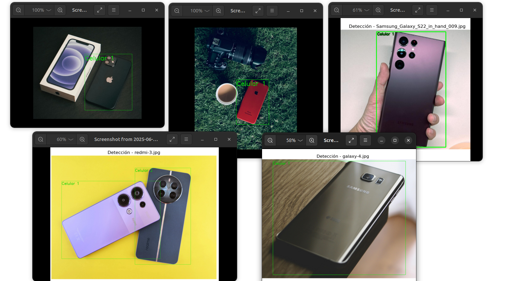
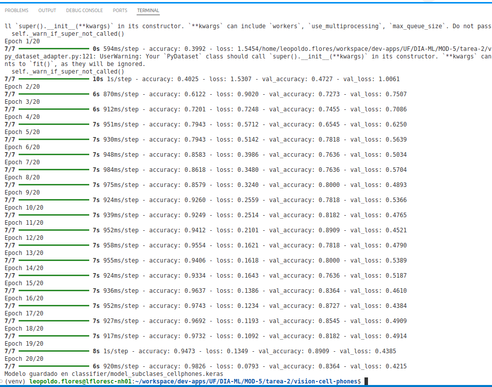
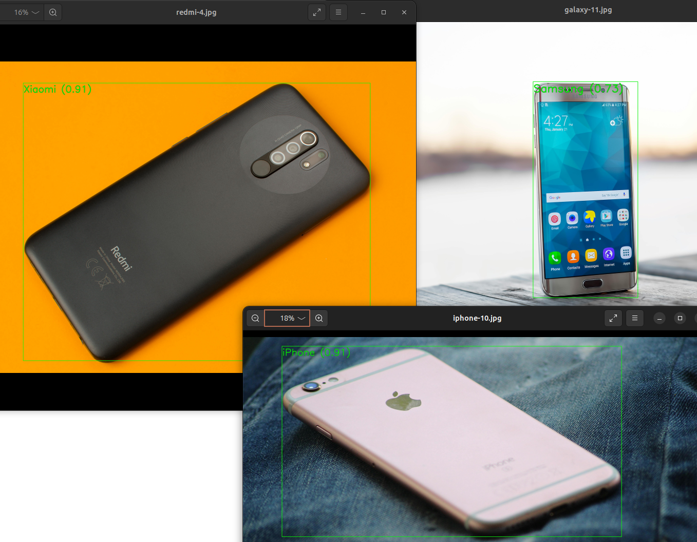

# TAREA 2: Detección e Identificación de Subclases de Objetos con YOLO y TensorFlow

## Índice

- [1. Objetivo de la tarea](#1-objetivo-de-la-tarea)
- [2. Arquitectura general del pipeline](#2-arquitectura-general-del-pipeline)
- [3. Detección de teléfonos celulares](#3-detección-de-teléfonos-celulares)
  - [Fragmento relevante del código](#fragmento-relevante-del-código)
  - [Resultados](#resultados)
- [4. Clasificación de subclases personalizadas](#4-clasificación-de-subclases-personalizadas)
  - [Hiperparámetros](#hiperparámetros)
  - [Resultados del entrenamiento](#resultados-del-entrenamiento)
- [5. Integración del pipeline completo](#5-integración-del-pipeline-completo)
  - [Ejemplo de etiqueta resultante](#ejemplo-de-etiqueta-resultante)
  - [Fragmento relevante](#fragmento-relevante)
  - [Resultados](#resultados-1)
- [6. Instrucciones de uso](#6-instrucciones-de-uso)
  - [Paso 1: Crear entorno virtual e instalar dependencias](#paso-1-crear-entorno-virtual-e-instalar-dependencias)
  - [Paso 2: Entrenar el clasificador de subclases](#paso-2-entrenar-el-clasificador-de-subclases)
  - [Paso 3: Ejecutar detección de teléfonos celulares (YOLO)](#paso-3-ejecutar-detección-de-teléfonos-celulares-yolo)
  - [Paso 4: Ejecutar pipeline completo (detección--clasificación)](#paso-4-ejecutar-pipeline-completo-detección--clasificación)
- [7. Conclusiones](#7-conclusiones)
- [8. Recomendaciones futuras](#8-recomendaciones-futuras)
- [ANEXO A. Descarga automática de imágenes para entrenamiento](#anexo-a-descarga-automática-de-imágenes-para-entrenamiento)

## 1. Objetivo de la tarea

Aplicar técnicas de visión por computadora para detectar objetos genéricos (teléfonos celulares) utilizando un modelo preentrenado de detección (YOLO), y posteriormente realizar una segunda etapa de clasificación para identificar subclases personalizadas (por ejemplo: marcas o tipos de teléfono celular) usando TensorFlow.

---

## 2. Arquitectura general del pipeline

El sistema se ha dividido en tres etapas principales:

1. **Detección de objetos genéricos (YOLOv8)**
2. **Entrenamiento de un clasificador de subclases (CNN con TensorFlow)**
3. **Pipeline de detección + clasificación integrada**

---

## 3. Detección de teléfonos celulares

**Script:** `yolo_detector/detect.py`

- Se utilizó el modelo preentrenado `yolov8m.pt` de la librería [Ultralytics YOLOv8](https://docs.ultralytics.com).
- Se seleccionó la clase `cell phone` (`class_id = 67` del dataset COCO).
- Se recorren las imágenes dentro de `data/raw_images`, y se detectan los teléfonos celulares, generando imágenes con bounding boxes en `data/detected_phones`.
- Se muestra cada resultado en pantalla con anotaciones legibles.

### Fragmento relevante del código

```python
label = f"Cell Phone {phone_count}"
cv2.putText(img, label, (x1, max(y1 - 20, 0)),
            cv2.FONT_HERSHEY_SIMPLEX, 12.0, (0, 255, 0), 30)
```

> Esto asegura que el texto sea visible claramente en las imágenes.

### Resultados



---

## 4. Clasificación de subclases personalizadas

**Script:** `classifier/train_classifier.py`

- Se construyó un clasificador simple en TensorFlow para identificar subclases de teléfonos.
- Se espera que el conjunto de datos de entrenamiento tenga una estructura como:

```
data/subclasses/
├── iphone/
├── samsung/
├── redmi/
```

- El modelo es una CNN simple (`Sequential`), entrenada con `ImageDataGenerator`.

### Hiperparámetros

- Épocas: 10 (se puede incrementar)
- Tamaño de imagen: 224x224
- Optimizer: Adam
- Pérdida: categorical_crossentropy

### Resultados del entrenamiento



---

## 5. Integración del pipeline completo

**Script:** `pipeline.py`

- Este archivo une los pasos anteriores: toma una imagen, detecta teléfonos con YOLO, recorta cada uno, y lo clasifica con el modelo entrenado.
- El resultado se guarda en `data/detected_phones` con las etiquetas de subclase sobre cada bounding box.

### Ejemplo de etiqueta resultante

```
iPhone (0.98)
Samsung (0.91)
```

### Fragmento relevante

```python
label, confidence = classify_subclass(crop_img)
text = f"{label} ({confidence:.2f})"
```

### Resultados



---

## 6. Instrucciones de uso

A continuación, se detallan los comandos necesarios para entrenar y ejecutar el pipeline completo del proyecto:

### Paso 1: Crear entorno virtual e instalar dependencias

```bash
python -m venv venv
source venv/bin/activate        # En Linux/macOS
# o en Windows:
# venv\Scripts\activate

pip install -r requirements.txt
```

---

### Paso 2: Entrenar el clasificador de subclases

Una vez que tengas las imágenes organizadas en `data/subclasses/`, ejecuta:

```bash
python classifier/train_classifier.py
```

Esto generará un modelo `.keras` entrenado con tus datos.

---

### Paso 3: Ejecutar detección de teléfonos celulares (YOLO)

Para detectar los teléfonos en las imágenes de `data/raw_images` y guardar los resultados en `data/detected_phones`, usa:

```bash
python yolo_detector/detect.py
```

---

### Paso 4: Ejecutar pipeline completo (detección + clasificación)

Esto une YOLO y el clasificador para mostrar la subclase de cada teléfono detectado:

```bash
python pipeline.py
```

El resultado se guarda también en `data/detected_phones` y se muestran los resultados visualmente.

## 7. Conclusiones

- Se ha logrado implementar un pipeline completo de detección + clasificación personalizado.
- La precisión de la clasificación depende directamente de la calidad del dataset utilizado para entrenar el clasificador.
- El uso de modelos livianos como YOLOv8n o YOLOv8m permite una buena relación velocidad/precisión.
- Esta arquitectura modular facilita extender el proyecto a otras clases genéricas (como “botella”, “zapato”, etc.).

---

## 8. Recomendaciones futuras

- Reemplazar el clasificador simple por uno basado en transfer learning (MobileNetV2, EfficientNet, etc.).
- Optimizar la ejecución para video en tiempo real.
- Exportar el modelo para uso en dispositivos móviles con TensorFlow Lite.


## ANEXO A. Descarga automática de imágenes para entrenamiento

Para facilitar el entrenamiento del clasificador, se desarrolló un script que permite descargar automáticamente imágenes desde Internet (usando el buscador DuckDuckGo). Este script descarga imágenes de teléfonos celulares pertenecientes a diferentes subclases (por ejemplo, iPhone, Samsung Galaxy, Redmi) y las guarda en la carpeta correspondiente.

### Script: `scripts/bulk_img_download.py`

Este script utiliza la librería `duckduckgo-search` para buscar imágenes relevantes. Las imágenes se almacenan en subdirectorios dentro de `data/subclasses/`, siguiendo esta estructura:

```
data/subclasses/
├── iphone/
├── samsung/
├── redmi/
```

### Instalación de dependencias requeridas

Asegúrate de instalar la versión adecuada del paquete:

```bash
pip install duckduckgo-search==0.9
```

También necesitarás:

```bash
pip install requests pillow
```

### Ejecución del script

Para ejecutar el script y descargar hasta 100 imágenes por subclase, utiliza:

```bash
python scripts/bulk_img_download.py
```

El script automáticamente creará las carpetas necesarias (si no existen) y descargará imágenes relevantes para cada una de las clases especificadas.

### Personalización

Puedes modificar las búsquedas agregando o cambiando los términos en el código:

```python
download_images("iPhone 13 front", "data/subclasses/iphone", max_images=100)
download_images("Samsung Galaxy S22 front", "data/subclasses/samsung", max_images=100)
download_images("Redmi Note 12 front", "data/subclasses/redmi", max_images=100)
```

Esto te permite adaptar fácilmente la búsqueda a nuevos modelos, perspectivas, o dispositivos.